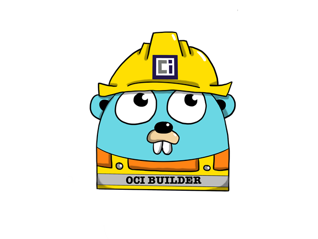

# Introduction

The OCI Builder is a tool for producing oci complaint images. 

This repository contains all the documentation for getting started and configuring the OCI Builder.

## Quick Start

You can get started with the OCI Builder by following the [quickstart guide](./quickstart).

## Commands

Documentation of the cli commands for OCI Builder can be found [here](./commands/build)

## Specification

A complete documentation of the entire OCI Builder specification file `ocibuilder.yaml` can be found [here](./specification/specification/)

## Examples

Some specification examples are available [here](./examples/complete-spec)

## Features

Features offered by the OCI Builder are documented [here](./features/environment-variables)

